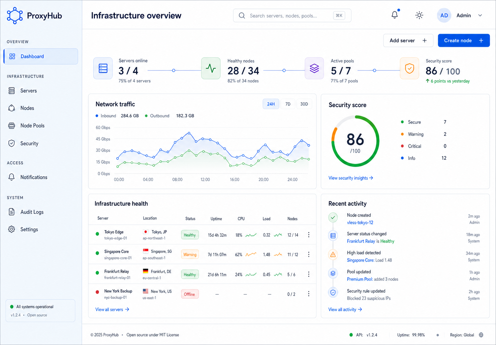
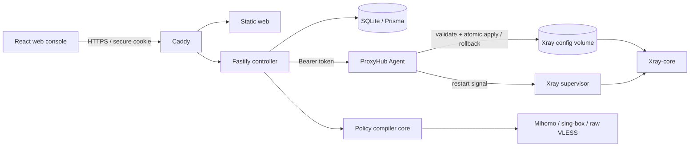

# ProxyHub

ProxyHub is a modern, open-source proxy infrastructure management platform for Linux VPS hosts. V0.2 adds a client-independent Policy Studio and secure subscription compiler to the stabilized V0.1 infrastructure foundation.



> Status: V0.2 Policy Studio & Subscription Engine implemented and locally verified. **V0.1.1 Linux Production Smoke Test Pending**; do not treat this revision as production-accepted until the VPS checklist passes.

### V0.1.1 implementation notes

- The local controller, authenticated local Agent, administrator security flows, Reality node and node-pool APIs, notifications, and audit logs are implemented.
- Node create, edit, clone, enable, disable, and delete rebuild the complete enabled-node configuration and commit only after Agent validation, atomic apply, restart acknowledgement, and health checks succeed.
- Node pools support create, read, edit, delete, enable, disable, and batch membership replacement in the API and web console.
- The dashboard labels its chart as Demo Data and explicitly reports that traffic collection is not configured. Traffic accounting remains separate roadmap work.
- Xray health combines process, companion-container heartbeat, configured-port listening, and live config validation checks into `HEALTHY`, `DEGRADED`, `OFFLINE`, or `UNKNOWN`.
- Remote Agent enrollment and remote server creation are not part of V0.1; the Servers page reports the seeded local controller and local Agent.

## Features

- Secure first-run administrator bootstrap
- Argon2id password hashing and opaque, hashed server-side sessions
- TOTP two-factor authentication with QR enrollment
- Ten one-time recovery codes stored only as Argon2id hashes
- Login lockout, new-IP security events, session inventory, and logout-all
- Live controller and Agent status
- VLESS Reality quick creation with generated UUID, X25519 keypair, Short ID, Vision flow, and client URI
- AES-256-GCM encryption for Reality private keys and TOTP secrets
- Xray configuration test, temporary-file cleanup, revision backup, atomic apply, acknowledged restart, health check, and rollback
- Node and node-pool CRUD with many-to-many membership
- Web notification center and searchable audit log
- Client-independent policies with ordered, first-match-wins rules and node-pool actions
- Deterministic Mihomo, sing-box, and raw VLESS subscription compilers with explicit diagnostics
- Hashed, rotatable subscription tokens with expiry, rate limiting, ETag, and one-time token display
- Policy Studio and subscription management pages with masked-by-default previews
- Light/dark themes, command palette, responsive navigation, tables, dialogs, and QR sharing
- SQLite through Prisma migrations, with a schema designed for later PostgreSQL migration
- Docker Compose deployment with Caddy automatic HTTPS

## Architecture



The controller never accepts arbitrary shell commands. System actions are fixed functions, Agent requests use a dedicated token, and Xray changes are rejected unless `xray run -test` succeeds. Each apply receives a unique rollback revision. The backup is retained until the database transaction commits and is restored automatically if restart or health verification fails.

## Requirements

For Docker deployment:

- Linux VPS
- Docker Engine 24+
- Docker Compose v2
- A DNS record pointing to the VPS for public HTTPS (or `localhost` for local evaluation)

For development:

- Node.js 22+ (tested with Node.js 24)
- pnpm 11+

## Docker deployment

```bash
git clone <your-repository-url> proxyhub
cd proxyhub
cp .env.example .env
openssl rand -base64 32
openssl rand -base64 32
# Edit .env: replace ENCRYPTION_KEY and AGENT_TOKEN, then set PANEL_DOMAIN and WEB_ORIGIN.
docker compose up -d --build
```

Do not start production with the placeholder values from `.env.example`; ProxyHub rejects them. Keep `.env` out of source control and never reuse either generated secret.

Open `https://$PANEL_DOMAIN`, create the first administrator, and then enable 2FA from **Security**. Caddy provisions a public certificate automatically when `PANEL_DOMAIN` is a resolvable public hostname and ports 80/443 reach the VPS. For `localhost`, Caddy uses its local CA.

Check services:

```bash
docker compose ps
docker compose logs -f proxyhub-server proxyhub-agent xray caddy
```

## Environment variables

| Variable                 | Required           | Default                      | Purpose                                                      |
| ------------------------ | ------------------ | ---------------------------- | ------------------------------------------------------------ |
| `PANEL_DOMAIN`           | Yes for public use | `localhost`                  | Caddy host and certificate name                              |
| `WEB_ORIGIN`             | Yes for public use | `https://localhost`          | Allowed credentialed browser origin                          |
| `ENCRYPTION_KEY`         | Yes                | none in Compose              | Encrypts TOTP and Reality secrets; use 32+ random characters |
| `AGENT_TOKEN`            | Yes                | none in Compose              | Authenticates controller-to-Agent calls                      |
| `DATABASE_URL`           | No                 | `file:/app/data/proxyhub.db` | Prisma SQLite database URL                                   |
| `SESSION_TTL_HOURS`      | No                 | `24`                         | Session lifetime                                             |
| `TRUST_PROXY`            | No                 | `true` in Compose            | Trusts Caddy forwarding headers                              |
| `XRAY_BINARY`            | No                 | `/usr/local/bin/xray`        | Fixed Xray executable path                                   |
| `XRAY_HEALTH_TIMEOUT_MS` | No                 | `12000`                      | Restart acknowledgement and health-check timeout             |

Never reuse `ENCRYPTION_KEY` as the Agent token. Back up the encryption key separately; encrypted secrets cannot be recovered without it.
Production startup rejects the development defaults and the placeholder values from `.env.example`.

## Development

```bash
pnpm install
pnpm db:generate

# On first local run, create the SQLite file if Prisma cannot create it on your OS:
mkdir -p apps/server/prisma/data
touch apps/server/prisma/data/proxyhub.db

DATABASE_URL=file:./data/proxyhub.db pnpm --filter @proxyhub/server db:migrate
DATABASE_URL=file:./data/proxyhub.db pnpm --filter @proxyhub/server db:seed
pnpm dev
```

The web console is available at `http://localhost:5173`; Vite proxies `/api` to `http://localhost:3000`. Start the local Agent separately when testing Xray operations:

```bash
pnpm --filter @proxyhub/agent dev
```

## Quality commands

```bash
pnpm typecheck
pnpm lint
pnpm format:check
pnpm test
pnpm build
```

The integration suite creates an isolated SQLite database, applies every real migration, and covers administrator bootstrap, sessions, TOTP, recovery codes, transactional Reality node synchronization, failed-apply rollback, node-pool replacement, dashboard health aggregation, policy and rule lifecycle, deterministic compilation, subscription token rotation/expiry, notifications, and audit logs.

The complete Linux deployment acceptance procedure is in [docs/deployment-smoke-test.md](docs/deployment-smoke-test.md).

## API

All responses use `{ "success": true, "data": ... }` or:

```json
{
  "success": false,
  "error": {
    "code": "VALIDATION_ERROR",
    "message": "The request is invalid",
    "details": []
  }
}
```

| Method                   | Path                                | Purpose                                    |
| ------------------------ | ----------------------------------- | ------------------------------------------ |
| `GET`                    | `/api/health`                       | Controller health                          |
| `GET`                    | `/api/auth/status`                  | First-run bootstrap state                  |
| `POST`                   | `/api/auth/bootstrap`               | Create the first administrator             |
| `POST`                   | `/api/auth/login`                   | Password plus optional TOTP/recovery login |
| `POST`                   | `/api/auth/logout`                  | Revoke the current session                 |
| `GET`                    | `/api/auth/me`                      | Current administrator                      |
| `GET`, `DELETE`          | `/api/auth/sessions`                | List sessions / log out all                |
| `POST`                   | `/api/auth/2fa/setup`               | Generate TOTP enrollment                   |
| `POST`                   | `/api/auth/2fa/enable`              | Verify TOTP and issue recovery codes       |
| `GET`, `POST`            | `/api/nodes`                        | List/create Reality nodes                  |
| `PATCH`, `DELETE`        | `/api/nodes/:id`                    | Update/delete a node                       |
| `POST`                   | `/api/nodes/:id/clone`              | Clone with fresh credentials               |
| `GET`                    | `/api/nodes/:id/share`              | VLESS URI and QR code                      |
| `GET`, `POST`            | `/api/node-pools`                   | List/create node pools                     |
| `PUT`, `DELETE`          | `/api/node-pools/:id`               | Replace/delete a pool                      |
| `GET`, `POST`            | `/api/policies`                     | List/create policies                       |
| `GET`, `PATCH`, `DELETE` | `/api/policies/:id`                 | Read/update/delete a policy                |
| `POST`                   | `/api/policies/:id/duplicate`       | Duplicate a policy and its rules           |
| `POST`                   | `/api/policies/:id/rules`           | Add an ordered policy rule                 |
| `PATCH`, `DELETE`        | `/api/policies/:id/rules/:ruleId`   | Update/delete a rule                       |
| `PUT`                    | `/api/policies/:id/rules/reorder`   | Persist the complete rule order            |
| `POST`                   | `/api/policies/:id/compile-preview` | Compile with diagnostics                   |
| `GET`, `POST`            | `/api/subscriptions`                | List/create subscriptions                  |
| `GET`, `PATCH`, `DELETE` | `/api/subscriptions/:id`            | Read/update/delete a subscription          |
| `POST`                   | `/api/subscriptions/:id/rotate`     | Rotate and display a token once            |
| `POST`                   | `/api/subscriptions/:id/preview`    | Authenticated masked preview               |
| `GET`                    | `/sub/:token`                       | Token-authenticated compiled subscription  |
| `GET`                    | `/api/dashboard`                    | Aggregated operational overview            |
| `GET`                    | `/api/servers`                      | Server inventory                           |
| `GET`                    | `/api/xray/status`                  | Agent/Xray status                          |
| `POST`                   | `/api/xray/restart`                 | Validated fixed restart action             |
| `GET`                    | `/api/notifications`                | Notification center                        |
| `PATCH`                  | `/api/notifications/:id/read`       | Mark one notification read                 |
| `POST`                   | `/api/notifications/read-all`       | Mark all notifications read                |
| `GET`                    | `/api/audit-logs`                   | Recent audit records                       |

## Database

The foundation migration creates `AdminUser`, `Session`, `RecoveryCode`, `ApiToken`, `Server`, `Agent`, `Node`, `NodePool`, `NodePoolMember`, `Notification`, `SecurityEvent`, `AuditLog`, and `SystemSetting`. The additive V0.2 migration creates `Policy`, `PolicyRule`, and `Subscription` without rebuilding or deleting foundation data.

Sensitive values are never stored in plaintext:

- passwords and recovery codes: Argon2id
- session and API tokens: SHA-256 hashes
- TOTP secrets and Reality private keys: AES-256-GCM
- logs and audit metadata: recursive key-based redaction

## Project structure

```text
apps/
  web/                 React + Vite management console
  server/              Fastify controller and Prisma schema
  agent/               Authenticated VPS Agent
packages/
  shared/              Shared schemas, API types, event constants
  xray-manager/        Reality adapter and validated config operations
  policy-core/         Normalizer, validator, capability matrix, and client adapters
docker/                Images, Caddy, nginx, Xray supervisor
docs/design/           Accepted visual design reference
```

## Security notes

- Deploy the panel behind Caddy HTTPS; production cookies are `Secure`, `HttpOnly`, and `SameSite=Strict`.
- Do not expose port 3000 or 3001 publicly.
- Rotate `AGENT_TOKEN` if it may have leaked.
- Keep `.env`, the SQLite volume, and backups readable only by administrators.
- ProxyHub reports SSH/firewall recommendations but does not modify host SSH policy automatically.
- The V0.1 Agent token is a foundation mechanism; mutually authenticated remote Agent enrollment is planned.

## V0.2 documentation

- [Architecture and data flow](docs/v0.2-architecture.md)
- [Policy Studio and compiler behavior](docs/policy-studio.md)
- [Subscription Engine and token security](docs/subscription-engine.md)
- [Linux VPS deployment smoke test](docs/deployment-smoke-test.md)

## Roadmap

V0.2 is intentionally limited to policies, deterministic client adapters, and secure subscriptions. Traffic collection, quotas, billing, remote Agent enrollment, users/plans, imports, automation, and multi-server orchestration remain future work. No V0.3 feature is included in this revision.

## Contributing

Use a focused branch, include tests for behavioral changes, run all quality commands, and never add an arbitrary command-execution endpoint. Database changes must include a Prisma migration, and all Xray configuration changes must preserve validate-before-apply behavior.

## License

[MIT](LICENSE)
