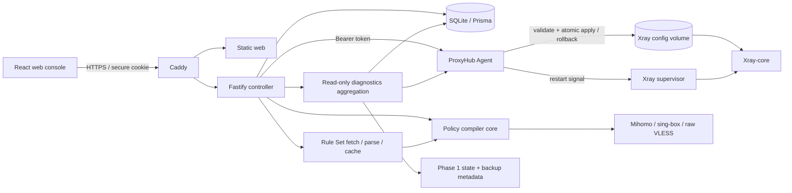

# ProxyHub

ProxyHub is a modern, open-source proxy infrastructure management platform for Linux VPS hosts. V0.3.1 stabilization adds release operations, read-only diagnostics, guided setup, subscription readiness, safe client delivery, and an English/Simplified Chinese Web console.


> Status: **V0.3.1 Stabilization in progress — Development / Pre-production**.
>
> - Phase 1 — Release and Operations Foundation: **Code and CI Complete; VPS Deployment Pending**.
> - Phase 2 — Diagnostics Center and Runtime Observability: **Code and CI Complete; VPS Deployment Pending**.
> - Phase 3 — Guided Workflow, Subscription Readiness, Client Delivery, and Localization: **Code Complete; CI and VPS Deployment Pending; Real Client Import Verification Pending**.
> - Reality Target Compatibility Hotfix: **Code and CI Verified; VPS Verification Pending**.

### V0.1.1 implementation notes

- The local controller, authenticated local Agent, administrator security flows, Reality node and node-pool APIs, notifications, and audit logs are implemented.
- Node create, edit, clone, enable, disable, and delete rebuild the complete enabled-node configuration and commit only after Agent validation, atomic apply, restart acknowledgement, and health checks succeed.
- Node pools support create, read, edit, delete, enable, disable, and batch membership replacement in the API and web console.
- The dashboard labels its chart as Demo Data and explicitly reports that traffic collection is not configured. Traffic accounting remains separate roadmap work.
- Xray health combines process, companion-container heartbeat, configured-port listening, and live config validation checks into `HEALTHY`, `DEGRADED`, `OFFLINE`, or `UNKNOWN`.
- Remote Agent enrollment and remote server creation are not part of V0.1; the Servers page reports the seeded local controller and local Agent.

## Features

- Secure first-run administrator bootstrap
- Argon2id password hashing and opaque, hashed server-side sessions
- TOTP two-factor authentication with QR enrollment
- Ten one-time recovery codes stored only as Argon2id hashes
- Login lockout, new-IP security events, session inventory, and logout-all
- Live controller and Agent status
- VLESS Reality quick creation with generated UUID, X25519 keypair, Short ID, Vision flow, and client URI
- Live Reality target preflight with isolated temporary Xray server/client processes and end-to-end HTTPS traffic proof
- AES-256-GCM encryption for Reality private keys and TOTP secrets
- Xray configuration test, temporary-file cleanup, revision backup, atomic apply, acknowledged restart, health check, and rollback
- Node and node-pool CRUD with many-to-many membership
- Web notification center and searchable audit log
- Client-independent policies with ordered, first-match-wins rules and node-pool actions
- Deterministic Mihomo, sing-box, and raw VLESS subscription compilers with explicit diagnostics
- Hashed, rotatable subscription tokens with expiry, rate limiting, ETag, and one-time token display
- Policy Studio and subscription management pages with always-sanitized previews
- English and Simplified Chinese Web locales with browser detection, browser-local persistence, and English fallback
- Data-derived Dashboard Quick Start, resource dependency/delete impact analysis, and backend delete rechecks
- Server-side Subscription Readiness preflight, bounded compiler dry runs, response tests, and compiler-derived client capability guides
- Reusable Manual and Remote Rule Sets with normalized cache, deterministic SHA-256 revisions, bounded previews, import/export, and Policy usage protection
- HTTPS-only remote provider fetching with DNS/redirect SSRF validation, decompressed size limits, timeouts, conditional ETag/Last-Modified refresh, and Last Known Good fallback
- Light/dark themes, command palette, responsive navigation, tables, dialogs, and QR sharing
- SQLite through Prisma migrations, with a schema designed for later PostgreSQL migration
- Docker Compose deployment with Caddy automatic HTTPS
- Canonical build identity, schema-validated release manifests, digest-pinned GHCR images, and OCI labels
- Linux preflight/health/deploy/update/rollback operations with a global lock and atomic transaction state
- WAL-safe SQLite backup create/list/verify/prune with integrity checks and conservative retention
- Administrator-only read-only diagnostics with bounded overview caching, manual deep scan, operations visibility, and sanitized JSON export

## Architecture



The controller never accepts arbitrary shell commands. System actions are fixed functions, Agent requests use a dedicated token, and Xray changes are rejected unless `xray run -test` succeeds. Each apply receives a unique rollback revision. The backup is retained until the database transaction commits and is restored automatically if restart or health verification fails.

## Requirements

For production image deployment:

- Linux VPS
- Docker Engine 24+
- Docker Compose v2
- `git`, `curl`, `jq`, `sqlite3`, `tar`, `gzip`, `sha256sum`, and `flock`
- A DNS record pointing to the VPS for public HTTPS (or `localhost` for local evaluation)

For development:

- Node.js 22+ (tested with Node.js 24)
- pnpm 11+

## Docker deployment

Production deployments should use a CI-generated, digest-pinned release manifest:

```bash
cp .env.example .env
# Replace ENCRYPTION_KEY and AGENT_TOKEN; set PANEL_DOMAIN and WEB_ORIGIN.
scripts/ops/preflight.sh --manifest /path/to/release-manifest.json
scripts/ops/deploy.sh --manifest /path/to/release-manifest.json --yes
```

The source-build workflow remains available for local evaluation:

```bash
git clone <your-repository-url> proxyhub
cd proxyhub
cp .env.example .env
openssl rand -base64 32
openssl rand -base64 32
# Edit .env: replace ENCRYPTION_KEY and AGENT_TOKEN, then set PANEL_DOMAIN and WEB_ORIGIN.
docker compose up -d --build
```

Do not start production with the placeholder values from `.env.example`; ProxyHub rejects them. Keep `.env` out of source control and never reuse either generated secret.

Open `https://$PANEL_DOMAIN`, create the first administrator, and then enable 2FA from **Security**. Caddy provisions a public certificate automatically when `PANEL_DOMAIN` is a resolvable public hostname and ports 80/443 reach the VPS. For `localhost`, Caddy uses its local CA.

Check services:

```bash
docker compose ps
docker compose logs -f proxyhub-server proxyhub-agent xray caddy
```

## Environment variables

| Variable                               | Required           | Default                      | Purpose                                                       |
| -------------------------------------- | ------------------ | ---------------------------- | ------------------------------------------------------------- |
| `PANEL_DOMAIN`                         | Yes for public use | `localhost`                  | Caddy host and certificate name                               |
| `WEB_ORIGIN`                           | Yes for public use | `https://localhost`          | Allowed credentialed browser origin                           |
| `ENCRYPTION_KEY`                       | Yes                | none in Compose              | Encrypts TOTP and Reality secrets; use 32+ random characters  |
| `AGENT_TOKEN`                          | Yes                | none in Compose              | Authenticates controller-to-Agent calls                       |
| `DATABASE_URL`                         | No                 | `file:/app/data/proxyhub.db` | Prisma SQLite database URL                                    |
| `SESSION_TTL_HOURS`                    | No                 | `24`                         | Session lifetime                                              |
| `TRUST_PROXY`                          | No                 | `true` in Compose            | Trusts Caddy forwarding headers                               |
| `XRAY_BINARY`                          | No                 | `/usr/local/bin/xray`        | Fixed Xray executable path                                    |
| `XRAY_HEALTH_TIMEOUT_MS`               | No                 | `12000`                      | Restart acknowledgement and health-check timeout              |
| `REALITY_COMPATIBILITY_TIMEOUT_MS`     | No                 | `20000`                      | Global timeout for the isolated live Reality target preflight |
| `RULE_SET_MAX_BYTES`                   | No                 | `5242880`                    | Maximum decompressed remote Rule Set response                 |
| `RULE_SET_MAX_RULES`                   | No                 | `50000`                      | Maximum normalized rules per remote source                    |
| `RULE_SET_FETCH_TIMEOUT_MS`            | No                 | `10000`                      | Remote fetch timeout in milliseconds                          |
| `RULE_SET_MAX_REDIRECTS`               | No                 | `3`                          | Maximum validated redirects                                   |
| `RULE_SET_ALLOW_HTTP`                  | No                 | `false`                      | Development-only HTTP opt-in; keep false in production        |
| `PROXYHUB_DIAGNOSTICS_ENABLED`         | No                 | `true`                       | Enables administrator-only read-only diagnostics              |
| `PROXYHUB_DIAGNOSTICS_CACHE_TTL_MS`    | No                 | `10000`                      | Overview cache TTL, bounded from 5–60 seconds                 |
| `PROXYHUB_DIAGNOSTICS_DEEP_TIMEOUT_MS` | No                 | `30000`                      | Manual deep scan global timeout                               |
| `PROXYHUB_DIAGNOSTICS_MAX_HISTORY`     | No                 | `20`                         | Maximum release/transaction entries returned                  |
| `PROXYHUB_DIAGNOSTICS_MAX_BACKUPS`     | No                 | `50`                         | Maximum backup metadata entries returned                      |

Never reuse `ENCRYPTION_KEY` as the Agent token. Back up the encryption key separately; encrypted secrets cannot be recovered without it.
Production startup rejects the development defaults and the placeholder values from `.env.example`.

## Development

```bash
pnpm install
pnpm db:generate

# On first local run, create the SQLite file if Prisma cannot create it on your OS:
mkdir -p apps/server/prisma/data
touch apps/server/prisma/data/proxyhub.db

DATABASE_URL=file:./data/proxyhub.db pnpm --filter @proxyhub/server db:migrate
DATABASE_URL=file:./data/proxyhub.db pnpm --filter @proxyhub/server db:seed
pnpm dev
```

The web console is available at `http://localhost:5173`; Vite proxies `/api` to `http://localhost:3000`. Start the local Agent separately when testing Xray operations:

```bash
pnpm --filter @proxyhub/agent dev
```

## Quality commands

```bash
pnpm typecheck
pnpm lint
pnpm format:check
pnpm test
pnpm build
pnpm test:compat
pnpm test:migration
pnpm test:rulesets
pnpm test:runtime-packages
pnpm test:manifest
pnpm test:ops
pnpm lint:shell
# Windows: download, checksum, and validate with the pinned official client cores
pnpm compat:validate:windows
```

The integration suite creates isolated SQLite databases, tests fresh, V0.1.1, and populated V0.2.1-to-V0.3 upgrades, and covers administrator security, Xray rollback, policies, Rule Set CRUD/import/cache/SSRF/LKG/concurrency, deterministic compilation, subscriptions, notifications, and audit logs. The runtime package regression asserts that every Server workspace dependency resolves to compiled `dist/index.js`, never TypeScript under `src`. GitHub Actions additionally builds immutable images, starts Web, Server, Agent, Xray, and Caddy, requires health with zero restarts, validates build metadata and SQLite, creates/verifies a backup, exercises dry-run operations, and simulates a failed update in an isolated Compose project.

The complete Linux deployment acceptance procedure is in [docs/deployment-smoke-test.md](docs/deployment-smoke-test.md). Diagnostics architecture and safety boundaries are documented in [docs/diagnostics/overview.md](docs/diagnostics/overview.md).

## API

All responses use `{ "success": true, "data": ... }` or:

```json
{
  "success": false,
  "error": {
    "code": "VALIDATION_ERROR",
    "message": "The request is invalid",
    "details": []
  }
}
```

| Method                   | Path                                     | Purpose                                    |
| ------------------------ | ---------------------------------------- | ------------------------------------------ |
| `GET`                    | `/api/health`                            | Controller health                          |
| `GET`                    | `/api/auth/status`                       | First-run bootstrap state                  |
| `POST`                   | `/api/auth/bootstrap`                    | Create the first administrator             |
| `POST`                   | `/api/auth/login`                        | Password plus optional TOTP/recovery login |
| `POST`                   | `/api/auth/logout`                       | Revoke the current session                 |
| `GET`                    | `/api/auth/me`                           | Current administrator                      |
| `GET`, `DELETE`          | `/api/auth/sessions`                     | List sessions / log out all                |
| `POST`                   | `/api/auth/2fa/setup`                    | Generate TOTP enrollment                   |
| `POST`                   | `/api/auth/2fa/enable`                   | Verify TOTP and issue recovery codes       |
| `GET`, `POST`            | `/api/nodes`                             | List/create Reality nodes                  |
| `POST`                   | `/api/nodes/reality-compatibility`       | Run an isolated live Reality target test   |
| `PATCH`, `DELETE`        | `/api/nodes/:id`                         | Update/delete a node                       |
| `POST`                   | `/api/nodes/:id/clone`                   | Clone with fresh credentials               |
| `GET`                    | `/api/nodes/:id/share`                   | VLESS URI and QR code                      |
| `GET`, `POST`            | `/api/node-pools`                        | List/create node pools                     |
| `PUT`, `DELETE`          | `/api/node-pools/:id`                    | Replace/delete a pool                      |
| `GET`, `POST`            | `/api/policies`                          | List/create policies                       |
| `GET`, `PATCH`, `DELETE` | `/api/policies/:id`                      | Read/update/delete a policy                |
| `POST`                   | `/api/policies/:id/duplicate`            | Duplicate a policy and its rules           |
| `POST`                   | `/api/policies/:id/rules`                | Add an ordered policy rule                 |
| `PATCH`, `DELETE`        | `/api/policies/:id/rules/:ruleId`        | Update/delete a rule                       |
| `PUT`                    | `/api/policies/:id/rules/reorder`        | Persist the complete rule order            |
| `POST`                   | `/api/policies/:id/compile-preview`      | Compile with diagnostics                   |
| `GET`, `POST`            | `/api/rule-sets`                         | List/create Rule Sets                      |
| `GET`, `PATCH`, `DELETE` | `/api/rule-sets/:id`                     | Read/update/delete with usage protection   |
| `POST`                   | `/api/rule-sets/:id/refresh`             | Refresh a remote source                    |
| `GET`                    | `/api/rule-sets/:id/preview`             | Read a bounded normalized-cache preview    |
| `POST`                   | `/api/rule-sets/test-source`             | SSRF-safe remote source test               |
| `POST`                   | `/api/rule-sets/parse-preview`           | Parse import content without saving        |
| `POST`                   | `/api/rule-sets/:id/import`              | Confirm manual bulk import                 |
| `GET`                    | `/api/rule-sets/:id/export`              | Export ProxyHub Native normalized rules    |
| `GET`, `POST`            | `/api/subscriptions`                     | List/create subscriptions                  |
| `GET`, `PATCH`, `DELETE` | `/api/subscriptions/:id`                 | Read/update/delete a subscription          |
| `POST`                   | `/api/subscriptions/:id/rotate-token`    | Rotate and display a token once            |
| `POST`                   | `/api/subscriptions/:id/preview`         | Authenticated sanitized preview            |
| `POST`                   | `/api/subscriptions/readiness`           | Preflight an unsaved subscription          |
| `POST`                   | `/api/subscriptions/:id/readiness`       | Run a no-mutation readiness check          |
| `POST`                   | `/api/subscriptions/:id/test-response`   | Simulate public response semantics safely  |
| `GET`                    | `/api/subscriptions/capabilities`        | Compiler-derived client capability matrix  |
| `GET`                    | `/api/setup/progress`                    | Data-derived guided setup progress         |
| `GET`                    | `/api/resources/:type/:id/dependencies`  | Bounded resource dependency analysis       |
| `GET`                    | `/api/resources/:type/:id/delete-impact` | Safe delete impact analysis                |
| `GET`                    | `/sub/:token`                            | Token-authenticated compiled subscription  |
| `GET`                    | `/api/dashboard`                         | Aggregated operational overview            |
| `GET`                    | `/api/servers`                           | Server inventory                           |
| `GET`                    | `/api/xray/status`                       | Agent/Xray status                          |
| `POST`                   | `/api/xray/restart`                      | Validated fixed restart action             |
| `GET`                    | `/api/notifications`                     | Notification center                        |
| `PATCH`                  | `/api/notifications/:id/read`            | Mark one notification read                 |
| `POST`                   | `/api/notifications/read-all`            | Mark all notifications read                |
| `GET`                    | `/api/audit-logs`                        | Recent audit records                       |
| `GET`                    | `/api/diagnostics/overview`              | Cached read-only diagnostics overview      |
| `GET`                    | `/api/diagnostics/{section}`             | Read-only diagnostics section              |
| `POST`                   | `/api/diagnostics/run`                   | Bounded manual deep diagnostics            |
| `GET`                    | `/api/diagnostics/export`                | Sanitized diagnostics JSON bundle          |

## Database

The foundation migration creates infrastructure and security tables. The additive V0.2 migration creates `Policy`, `PolicyRule`, and `Subscription`. The additive V0.3 migration creates `RuleSet`, `RuleSetEntry`, and `RuleSetCache`, then adds restrictive Rule Set references to `PolicyRule`; existing rules remain `INLINE` and no existing table or data is dropped.

Sensitive values are never stored in plaintext:

- passwords and recovery codes: Argon2id
- session and API tokens: SHA-256 hashes
- TOTP secrets and Reality private keys: AES-256-GCM
- logs and audit metadata: recursive key-based redaction

## Project structure

```text
apps/
  web/                 React + Vite management console
  server/              Fastify controller and Prisma schema
  agent/               Authenticated VPS Agent
packages/
  diagnostics-core/    Validated status, freshness, redaction, and report schemas
  shared/              Shared schemas, API types, event constants
  xray-manager/        Reality adapter and validated config operations
  policy-core/         Normalizer, validator, capability matrix, and client adapters
  rule-set-core/       Source parsers, normalization, deduplication, hashing, Golden tests
docker/                Images, Caddy, nginx, Xray supervisor
release/               Canonical version and release manifest schema
scripts/ops/           Linux deployment/update/rollback/backup operations
docs/design/           Accepted visual design reference
```

## Security notes

- Deploy the panel behind Caddy HTTPS; production cookies are `Secure`, `HttpOnly`, and `SameSite=Strict`.
- Do not expose port 3000 or 3001 publicly.
- Rotate `AGENT_TOKEN` if it may have leaked.
- Keep `.env`, the SQLite volume, and backups readable only by administrators.
- ProxyHub reports SSH/firewall recommendations but does not modify host SSH policy automatically.
- The V0.1 Agent token is a foundation mechanism; mutually authenticated remote Agent enrollment is planned.

## Architecture and operations documentation

- [Architecture and data flow](docs/v0.2-architecture.md)
- [Policy Studio and compiler behavior](docs/policy-studio.md)
- [Subscription Engine and token security](docs/subscription-engine.md)
- [V0.2.1 stabilization scope and evidence](docs/v0.2.1-stabilization.md)
- [Subscription compatibility matrix](docs/subscription-compatibility.md)
- [Linux VPS deployment smoke test](docs/deployment-smoke-test.md)
- [V0.3 Rule Set architecture](docs/v0.3-architecture.md)
- [Rule Set lifecycle and formats](docs/rule-sets.md)
- [Remote Rule Providers](docs/remote-rule-providers.md)
- [Rule Set SSRF and cache security](docs/rule-set-security.md)
- [Operations overview](docs/operations.md)
- [Release process and manifest](docs/release-process.md)
- [Fresh image deployment](docs/deployment.md)
- [Transactional update](docs/update.md)
- [Rollback safety](docs/rollback.md)
- [SQLite backup foundation](docs/backup.md)
- [Low-resource VPS behavior](docs/low-resource-vps.md)
- [Release state format](docs/release-state.md)
- [Operations troubleshooting](docs/troubleshooting.md)
- [Diagnostics Center](docs/diagnostics/overview.md)
- [Diagnostics security boundary](docs/diagnostics/security.md)
- [Sanitized diagnostics export](docs/diagnostics/export.md)
- [Diagnostics troubleshooting](docs/operations/troubleshooting.md)
- [Diagnostics on a low-resource VPS](docs/operations/low-resource-vps.md)
- [Language selection](docs/user-guide/language.md)
- [Quick Start](docs/user-guide/quick-start.md)
- [Subscription readiness](docs/user-guide/subscription-readiness.md)
- [Sanitized configuration preview](docs/user-guide/config-preview.md)
- [Client import guide](docs/user-guide/client-import.md)

## Roadmap

V0.3.1 Phase 1 provides the release and operations foundation, Phase 2 adds read-only diagnostics and runtime visibility, and Phase 3 adds guided setup, dependency-safe deletion, subscription readiness, sanitized client delivery, and Web localization. VPS deployment acceptance remains pending for all three phases. Reality Target Compatibility VPS verification, real Mihomo/sing-box GUI imports, real remote Rule Set public-network verification, and real GHCR update/rollback exercises remain pending. Automated repair, Web restart/deploy/update/rollback/restore controls, scheduled/cloud backups, automatic cross-schema database restore, distributed controllers, marketplace/sharing, AI rule generation, traffic collection, quotas, billing, mobile apps, and multi-server orchestration remain future work. Phase 4 and V0.4 have not started.

## Contributing

Use a focused branch, include tests for behavioral changes, run all quality commands, and never add an arbitrary command-execution endpoint. Database changes must include a Prisma migration, and all Xray configuration changes must preserve validate-before-apply behavior.

## License

[MIT](LICENSE)
