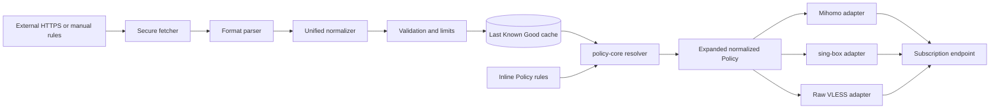

# ProxyHub V0.3 Architecture

V0.3 adds a reusable Rule Set ecosystem without changing the Xray runtime boundary.

## Ownership

- `rule-set-core`: parsers, canonical rule model, normalization, duplicate removal, stable serialization, content hash, Golden and performance tests.
- Server Rule Set service: authenticated CRUD, safe HTTPS fetch, conditional requests, Last Known Good, atomic Prisma cache replacement, scheduler, audit, notification, import/export, and usage protection.
- `policy-core`: resolves cached Rule Set references at the original PolicyRule position, validates adapter capabilities, and compiles deterministic output.
- Web: Rule Set management, bounded previews, bulk-import confirmation, and Policy Studio selection.
- Agent/xray-manager: unchanged; they continue to own server Xray runtime only.

## Data model

`RuleSet` stores metadata/status. Manual rules use ordered `RuleSetEntry` rows. `RuleSetCache` stores the current normalized JSON, SHA-256, counts, diagnostics, validators, and timestamps. `PolicyRule.matchSourceType` selects `INLINE` or `RULE_SET`; `ruleSetId` is a restrictive foreign key.

The V0.3 Migration is additive. Existing V0.2.1 rules receive `matchSourceType=INLINE` and `ruleSetId=NULL`.

## Determinism and order

Policy rules are first sorted by Policy priority/ID. Each Rule Set reference is expanded in place using stable cache order. Adapter validation runs after expansion. Health timestamps, fetch time, source validators, scheduler jitter, and Rule Set database ordering never enter public output or ETag.

The same Policy, nodes, pools, and Rule Set cache is compiled 100 times in tests for Mihomo, sing-box, and Raw. Raw routing remains unsupported and its VLESS URI output is unchanged.

## Release boundary

ProxyHub V0.3 remains Development / Pre-production. Linux Production Smoke Test Pending is still the release gate. V0.3 does not implement distributed scheduling, multi-controller coordination, marketplace/sharing, AI rule generation, traffic accounting, billing, or multi-tenant RBAC.
