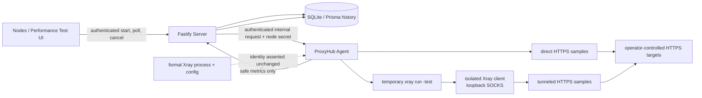

# V0.4 Phase 1 Architecture

V0.4 Phase 1 introduces a bounded Network Performance Test without moving runtime ownership away from the existing Server and Agent boundary.

Responsibilities remain separated:

- `network-performance-core` owns schemas, metric math, ratings, outlier analysis, and deterministic score calculation.
- `xray-manager` owns construction of the temporary client configuration.
- Agent owns network I/O, Xray validation/process lifecycle, SSRF defense, timeouts, cancellation, and cleanup.
- Server owns authorization, rate limiting, persistence, history retention, safe audit/notification integration, and recovery of interrupted runs.
- Web owns an on-demand workflow and presentation of real API states. It does not estimate or fabricate results.
- Diagnostics reads only a lightweight capability/recent-result summary and never starts a benchmark.

The `NetworkPerformanceRun` and `NetworkPerformanceTargetResult` tables are introduced by one additive Prisma migration. They do not alter existing Node, Policy, Rule Set, Subscription, release, or backup behavior.

Detailed metrics, scoring, configuration, and safety boundaries are documented in [network-performance.md](network-performance.md).
